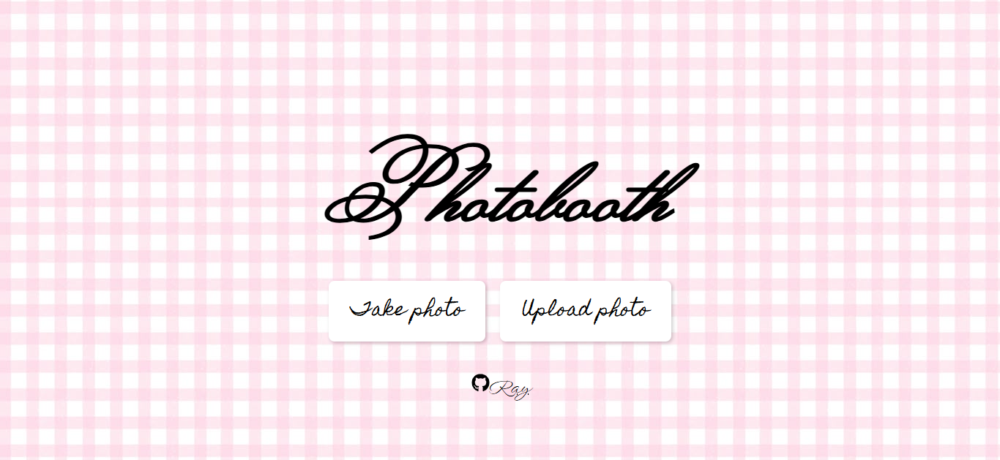
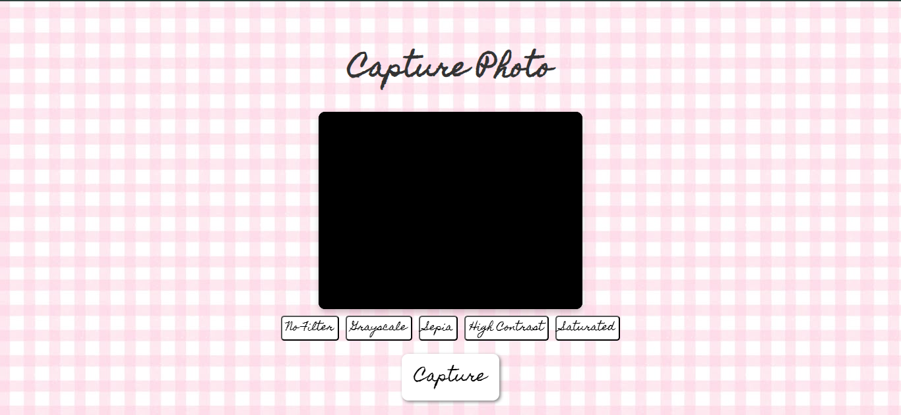
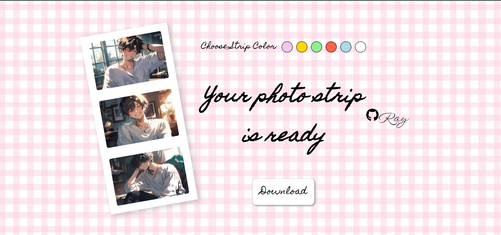

# 📸 PhotoBooth - Fun & Stylish Image Capturing App!
## 🚀 Live Demo  
🔗 [PhotoBooth - Try it Now!](https://photobooth7.vercel.app/)  


PhotoBooth is a **React-based web application** that enables users to **capture images using a webcam**, **upload local images**, and **apply CSS-based filters** for creative effects. It leverages **state management with React Hooks** and **context-based navigation with React Router** to provide a seamless user experience.  

 

## 🛠️ **Tech Stack** 
- **Webcam Capture** with real-time filters
- **Frontend:** React.js (with Hooks & State Management)  
- **Image Upload & Preview** functionality  
- **CSS Filter Effects** (Grayscale, Sepia, Saturation, Contrast)  
- **Photo Strip Generation** with adjustable backgrounds  
- **HTML Canvas (html2canvas)** for rendering and exporting images  
- **Styled UI with smooth navigation (React Router)**  


---

## 🚀 **Features**
- 📷 **Capture Photos:** Take pictures directly from your webcam  
- 🖼️ **Upload Images:** Select images from your device  
- 🎨 **Apply Filters:** Choose from multiple filter effects  
- 🏞 **Customize Photo Strip:** Change background colors dynamically  
- ⬇️ **Download Photo Strip:** Save your final masterpiece with a cool tilted effect  

---


## 📸 **Screenshots**

### 📌 Home Page  
  

### 📸 Capture Page  
  

### 🎞️ Photo Strip Page  
  


---
## 🚀 Future Advancements  

- **🔄 Undo & Redo Feature** – Allow users to revert changes while applying filters.  
- **🎭 Advanced Filters** – Integrate AI-powered filters using TensorFlow.js for face detection and effects.  
- **🌆 Background Removal** – Implement AI-based background removal for better customization.  
- **📱 Mobile-Friendly UI** – Improve responsiveness for a seamless experience on all devices.  
- **🎨 Sticker & Text Overlay** – Let users add stickers, emojis, and custom text to their photos.  
- **📂 Cloud Storage Integration** – Save and retrieve photo strips via Firebase or AWS S3.  
- **📤 Social Media Sharing** – Directly share photo strips to Instagram, Facebook, or Twitter.  
- **🖼️ GIF & Collage Creation** – Allow users to export their photo strips as GIFs or collages.  

Stay tuned for exciting updates! 🚀✨  

## 📥 **Installation & Setup**
1. **Clone the repository:**
   ```sh
   git clone https://github.com/your-username/photobooth.git
   cd photobooth
